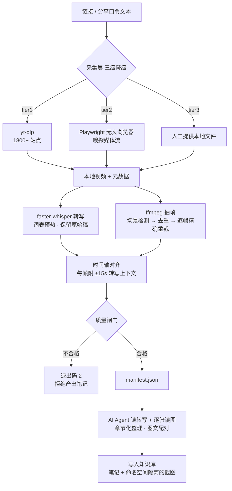

# 技术方案：本地视频笔记流水线

> 面向内部技术分享。关键词：yt-dlp / Playwright / faster-whisper / ffmpeg / 多模态整理

## 1. 背景

日常获取的高价值内容越来越多以视频形态存在，但视频信息密度低、无法检索、难以沉淀。商用「视频转笔记」服务能解决，但存在三个约束：按条计费、模板固定不可定制、内容需经第三方服务器。

目标：搭一条本地流水线，输入一个链接，输出带关键帧截图的结构化笔记并归档进知识库。约束是免费、可离线转写、磁盘占用最小化、笔记格式与既有知识库无缝兼容。

## 2. 架构



分层职责：

| 层 | 职责 | 关键取舍 |
|---|---|---|
| 采集 | 拿到可播放的本地文件 + 元数据 | 三级降级，最后一级不依赖任何平台接口 |
| 转写 | 语音转文字 | 本地离线，隐私不出机，无 API 成本 |
| 抽帧 | 选出有信息量的画面 | 三级策略（两级场景检测 → 等间隔），记录实际命中 |
| 对齐 | 建立图文关联 | 每帧附转写上下文，让配图有据可依 |
| 闸门 | 拒绝残缺素材 | 宁可失败，不产出"看似成功"的空笔记 |
| 整理 | 理解与写作 | 交给调用方 Agent，不内置 LLM 依赖 |

## 3. 关键实现

### 3.1 采集三级降级

```python
def acquire(url, out, log, cookies=None, local_file=None, timeout=90):
    if local_file:                      # tier 3
        return via_local_file(local_file, out, log, url)
    try:
        return via_ytdlp(url, out, log, cookies)   # tier 1
    except Exception as exc:
        log.warn(f"yt-dlp failed ({type(exc).__name__}), trying browser sniff")
    return via_browser(url, out, log, timeout)     # tier 2
```

tier 3 不是可选项。平台持续对抗抓取，只依赖自家正则的流水线终将失效；人工提供文件是唯一不受平台变更影响的通路。

### 3.2 媒体流嗅探与选流

监听浏览器网络响应，按域名语义打分而非文件大小排序：

```python
def _score(url, size):
    s = size
    if any(h in url for h in CDN_HINTS):    s += 10**12   # 真实流
    if any(h in url for h in DECOY_HINTS):  s -= 10**12   # 页面装饰
    return s
```

为什么不能只看 `content-length`：流媒体常为 chunked 编码，该头缺失或为 0，此时按大小排序等于随机排序。

**遍历全部候选**直到凑齐一条视频轨 + 一条音频轨（抖音 Web 播放器音视频分离）：

```bash
ffmpeg -y -i video_only -i audio_only -c copy -map 0:v:0 -map 1:a:0 merged.mp4
```

`-c copy` 不重编码，30MB 文件合并 <1s。

### 3.3 转写：词表预热 + 原始稿留存

```python
prompt = f"以下是一段中文视频内容，请使用简体中文输出。可能出现的专业词汇：{glossary}。"
segments, info = model.transcribe(wav, initial_prompt=prompt, vad_filter=True,
                                  condition_on_previous_text=False)
```

- 词表预热显著降低技术术语错字（未预热时"向量库"常被识别为"香凉库"）
- `condition_on_previous_text=False` 避免错误在长音频中累积传播
- 同时输出 `transcript.txt` 与 `transcript.raw.txt`，后者永不修改，任何后续纠正都可回溯

### 3.4 抽帧：三级策略 + 逐帧精确重截

```python
SCENE_THRESHOLDS = (0.25, 0.12)     # 两级递降
# 都不够 → 等间隔采样
```

先只收集候选时间点（`-f null -` 不写文件），dHash 去重后，对保留的时间点逐个精确重截：

```bash
ffmpeg -y -ss <exact_time> -i video -frames:v 1 -vf scale=1280:-2 -q:v 3 out.jpg
```

这样文件名由时间戳生成，二者强绑定——避免了"用 zip 配对日志与目录列表"的顺序假设风险。

### 3.5 图文时间轴对齐

```python
def context_around(segments, t, window=15.0):
    hits = [s["text"] for s in segments if s["end"] >= t-window and s["start"] <= t+window]
    if not hits:
        hits = [min(segments, key=lambda s: abs(s["start"] - t))["text"]]
    return " ".join(hits)[:400]
```

这是整条流水线里对最终质量影响最大的一处改动。没有它，配图只能靠"看图猜章节"——在幻灯片式视频上碰巧有效，遇到穿插剪辑就会错配。

### 3.6 质量闸门

```python
if tr.empty and not args.allow_empty_transcript:
    raise PipelineError("empty transcript: no speech recognised...")
if not frames and tr.empty:
    raise PipelineError("neither transcript nor frames produced")
```

最危险的失败不是报错，而是"看起来成功"。抓到无声视频流 → 空转写 → 一篇通顺但内容为空的笔记进了知识库，几乎不可能被及时发现。

## 4. 踩坑记录

### 坑 1：yt-dlp 对抖音已实质失效

报错 `Fresh cookies (not necessarily logged in) are needed` **是误导性提示**。真实原因是抖音 Web 详情 API 要求请求签名（a_bogus），提取器未实现签名逻辑，给多少 cookie 都无效。验证方式：手动构造 cookie（含 `s_v_web_id`）后直接请求 detail API，返回空。

结论：对强风控平台，浏览器嗅探比补 cookie 更可靠。

### 坑 2：抓到的"视频"可能是页面装饰

页面里常有 UI 动效 mp4（静态资源域名）。按文件大小取最大会误抓——必须按域名语义打分。

### 坑 3：huggingface_hub 的 xet 协议导致 401

国内镜像不代理 xet CAS 存储，新版 faster-whisper 默认走 xet 会 401：

```python
os.environ.setdefault("HF_ENDPOINT", "https://hf-mirror.com")
os.environ.setdefault("HF_HUB_DISABLE_XET", "1")
```

### 坑 4：场景检测阈值不是万能的

`scene>0.25` 对快节奏剪辑有效，对幻灯片式视频（字幕常驻、背景渐变）可能 0 命中。必须有等间隔兜底。实测该类视频走兜底路径效果同样好（每页停留约 50s，等间隔自然命中）。

### 坑 5：转写质量 ≠ 笔记质量

small 模型同音错字密集。**转写稿是中间产物，不能直接当笔记交付**，必须经 Agent 消化重写。但也要意识到：Agent 在不熟悉的领域可能纠错纠反，所以原始稿必须留存可核对。

### 坑 6：截图命名冲突会静默毁坏已有笔记

原型用 `wb_frame_01.jpg` 这类无标识命名，处理第二个视频时覆盖第一个视频已入库的图片，导致已有笔记里的插图悄悄变成别的视频画面。命名必须带内容或 URL 命名空间。

## 5. 实测数据

| 指标 | 数值 |
|---|---|
| 样本 | 抖音知识视频 12:18 |
| 采集 | tier1 失败 → tier2 成功，30MB（双流合并） |
| 转写 | 107 段，中文，CPU 约 2~3 分钟 |
| 抽帧 | 12 张，实际策略：interval（场景检测未达阈值） |
| 磁盘净增 | 约 3MB（笔记 + 截图），视频即处理即删 |
| 一次性占用 | whisper small 约 460MB |

## 6. 使用边界

本方案面向个人学习与知识管理。规模化或商业使用前需评估：平台服务条款、著作权、请求频率。详见 README「使用边界与合规」。

## 7. 后续规划

- CI 定时自检，及早发现平台接口变更
- 小红书图文笔记独立路径（解析 → 失败则用户截图 → 多模态读图）
- MLX-Whisper 接入（Apple Silicon 提速）
- 断点续传与长视频分段进度
- 封装为 MCP Server，供任意 Agent 调用

## 附：组件清单

| 组件 | 作用 | 许可 |
|---|---|---|
| yt-dlp | 视频下载 | Unlicense |
| Playwright + Chromium | 浏览器嗅探兜底 | Apache-2.0 |
| faster-whisper | 本地转写 | MIT |
| ffmpeg / ffprobe | 音频提取、合流、抽帧 | LGPL/GPL |
